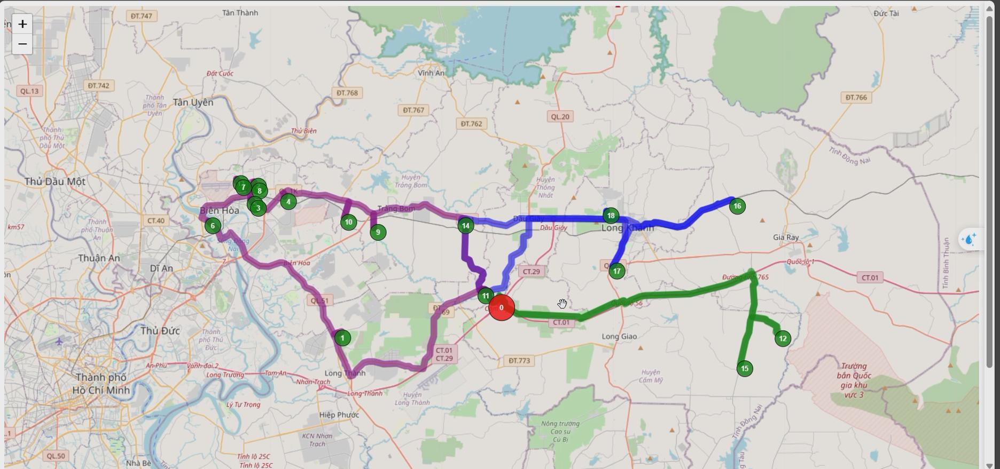

# Routing Problem Solver

## Description
This project is a routing problem solver that uses the ortools library to solve the problem. The problem is to find the shortest path that visits all the nodes in a graph and returns to the starting node. 

And i have implemented to Fast-API app to read data from csv and filter by Province and Order Date, and then send the data to the routing problem solver to get the shortest path and visualize it on the map using folium.

## Installation
1. Clone the repository
2. Install the requirements
```bash
pip install -r requirements.txt
```

## Usage
1. Run the Fast-API app
```bash
uvicorn main:app --reload
```
or 
```bash
python main.py
```
2. Open the browser and go to `http://localhost:8000/docs` to see the API documentation
3. Upload the csv file and select the Province and Order Date
4. Click on the `Try it out` button and then click on the `Execute` button
5. The response will be the shortest path and the map with the path visualized

